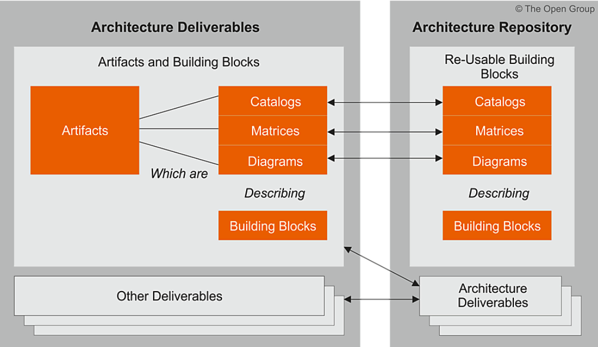

---
layout: post

title:  "TOGAF-企业架构框架1"

date:   2022-09-11

categories: what, tech

excerpt_separator: 企业架构, 架构框架，TOGAF
---
## WHY

* 为什么需要企业架构？
* 什么是企业架构框架？
* 什么是架构？
* TOGAF

## WHAT

### 企业架构的目的

> 企业架构的目的是在整个企业范围内将经常分散的流程（手动和自动化）传统优化到一个集成环境中，该环境可以响应变化并支持业务战略的交付

### 什么是架构框架

> 架构框架是一种基础结构或一组结构，可用于开发广泛的不同架构。它应该描述一种根据一组构建块设计企业目标状态的方法，并展示这些构建块如何组合在一起。它应该包含一组工具并提供一个通用词汇表。它还应包括可用于实施构建块的推荐标准和兼容产品列表。
>
> TOGAF 它提供了协助企业架构的验收、生产、使用和维护的方法和工具。它基于最佳实践支持的迭代过程模型和一组可重用的现有架构资产

### 什么是架构

* ISO/IEC/IEEE 42010:2011 将“架构”定义为：

> “系统在其环境中的基本概念或属性体现在其元素、关系以及其设计和演化的原则中。”

* 除了 ISO/IEC/IEEE 42010:2011 对“架构”的定义之外，TOGAF 标准还根据上下文定义了第二种含义：

> “组件的结构，它们的相互关系，以及随着时间的推移管理它们的设计和演变的原则和指导方针。”

### TOGAF的基本内容

* 第一部分（简介）这部分对企业架构的关键概念，特别是 TOGAF 方法进行了高级介绍。它包含本标准中使用的术语的定义。
* 第二部分（架构开发方法）这部分是TOGAF框架的核心。它描述了 TOGAF 架构开发方法 (ADM) - 一种逐步开发企业架构的方法。
* 第三部分（ADM 指南和技术）这部分包含一系列可用于应用 TOGAF 方法和 TOGAF ADM 的指南和技术。TOGAF 库中提供了其他指南和技术。
* 第四部分（架构内容框架）这部分描述了 TOGAF 内容框架，包括架构工件的结构化元模型、可重用架构构建块 (ABB) 的使用以及典型架构可交付成果的概述。
* 第五部分  (Enterprise Continuum & Tools) 这部分讨论适当的分类法和工具，用于对企业内架构活动的输出进行分类和存储。
* 第六部分（架构能力框架）这部分讨论了在企业内建立和运营架构功能所需的组织、流程、技能、角色和职责。

#### ADM架构开发方法 （Architecture Development Method）

* **初步阶段**描述了创建架构能力所需的准备和启动活动，包括 TOGAF 框架的定制和架构原则的定义
* **阶段 A：架构愿景**描述了架构开发周期的初始阶段它包括有关定义架构开发计划范围、识别利益相关者、创建架构愿景以及获得批准以继续进行架构开发的信息。
* **阶段 B：业务架构**描述了业务架构的开发，以支持商定的架构愿景
* **阶段 C：信息系统架构**描述了信息系统架构的开发，以支持商定的架构愿景
* **阶段 D：技术架构**描述了技术架构的开发，以支持商定的架构愿景
* **阶段 E：机会和解决方案**为之前阶段定义的架构进行初始实施规划和交付工具的识别
* **阶段 F：迁移计划**通过最终确定详细的实施和迁移计划来解决如何从基线迁移到目标架构
* **阶段 G：实施治理**提供实施的架构监督
* **阶段 H：架构变更管理**建立管理新架构变更的程序
* **需求管理**检查整个 ADM 中管理架构需求的过程

#### 架构内容框架 (Architecture Content Framework)

> 执行 ADM 的架构师将通过他们的努力产生许多输出，例如流程、架构要求、项目计划、项目合规性评估等。
>
> TOGAF 架构内容框架为架构内容提供了一个结构模型，允许一致地定义、结构化和呈现主要工作产品。

* 可**交付成果**是合同规定并由利益相关者正式审查、同意和签署的工作产品可交付成果代表项目的输出，那些呈文档形式的可交付成果通常会在项目完成时存档，或作为参考模型、标准或架构景观在某个时间点的快照转换为架构存储库。
* **工件**是描述架构的一个方面的架构工作产品人工制品通常分为目录（事物的列表）、矩阵（显示事物之间的关系）和图表（事物的图片）。示例包括需求目录、业务交互矩阵和用例图。一个架构交付物可能包含许多工件，工件将构成架构存储库的内容。
* 构建**块**代表企业能力的（可能可重用的）组件，可以与其他构建块组合以提供架构和解决方案构建块可以定义为不同的详细级别，具体取决于已达到架构开发的哪个阶段。例如，在早期阶段，构建块可以简单地由名称或概要描述组成。稍后，一个构建块可能会分解为多个支持构建块，并且可能会附带一个完整的规范。构建块可以与“架构”或“解决方案”相关。

> **架构构建块 (ABB)** 通常描述所需的能力并形成解决方案构建块 (SBB) 的规范；例如，企业内可能需要客户服务能力，由许多 SBB 支持，例如流程、数据和应用软件**解决方案构建块 (SBB)** 表示将用于实现所需功能的组件；例如，网络是一个构建块，可以通过互补的工件进行描述，然后用于为企业实现解决方

#### 企业连续统一体、存储库

企业连续统一体是架构存储库的一个视图，它提供了对架构和解决方案工件进行分类的方法，因为它们从通用基础架构演变为组织特定架构。企业连续统一体包括两个互补的概念：架构连续统一体和解决方案连续统一体。

> 支持企业连续统一体的是架构存储库，它可用于存储由 ADM 创建的不同抽象级别的不同类别的架构输出。

过这种方式，TOGAF 标准促进了不同层次的利益相关者和从业者之间的理解和合作。

* **架构元模型**描述了架构框架的组织定制应用，包括架构内容的元模型
* **架构能力**定义了支持架构存储库治理的参数、结构和流程
* **架构景观**是在特定时间点部署在运营企业内的资产的架构表示 - 架构可能存在于多个抽象级别以适应不同的架构目标
* **标准信息库** (SIB) 捕获新架构必须遵守的标准，其中可能包括行业标准、来自供应商的选定产品和服务，或已在组织内部署的共享服务
* **参考资料库**提供指南、模板、模式和其他形式的参考资料，可用于加速为企业创建新架构
* **治理日志**提供整个企业的治理活动记录
* **架构需求存储库**提供了与架构委员会达成一致的所有授权架构需求的视图
* **解决方案景观**展示了支持企业已规划或部署的架构景观的 SBB 的架构表示

#### 企业架构治理

为什么要架构治理？

> 运行一个持续架构的概念的核心是执行定义明确且有效的治理，由此所有架构上重要的活动都在一个框架内得到控制和调整。

架构治理的好处包括：

* 提高问责制的透明度和知情的权力下放
* 可控风险管理
* 通过最大限度地重复使用现有架构组件来保护现有资产基础
* 主动控制、监控和管理机制
* 跨所有组织业务部门重用流程、概念和组件
* 通过监控、测量、评估和反馈创造价值
* 提高支持内部流程和外部各方要求的可见性；特别是，提高较低级别决策的可见度，确保在企业内部适当级别监督可能对本组织产生深远战略影响的决策
* 更大的股东价值；特别是，企业架构越来越多地代表企业的核心知识产权——研究表明，股东价值增加与治理良好的企业之间存在相关性
* 与现有流程和方法集成，并通过添加控制功能来补充功能

## HOW

一句话总结TOGAF

TOGAF是一个架构框架，可用于开发广泛的不同架构，通过其ADM提供架构开发方法，架构师通过ADM产生的架构输出可有架构内容框架统一定义其格式和规范，其产生的文件和其他产出可以通过架构存储库来存储和迭代更新，最后通过架构治理方法论来保证架构能够实时的贴合组织发展最新要求

下一步

* TOGAF基本术语
* TOGAF ADM架构开发方法详解
* TOGAF ABB SBB 架构存储库
* 企业连续统一体、解决方案连续统一体
* 架构治理

## Refenence

* opengroup.org
* TOGAF官方文档
